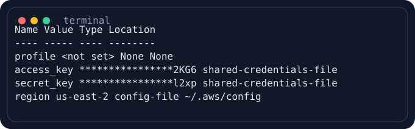
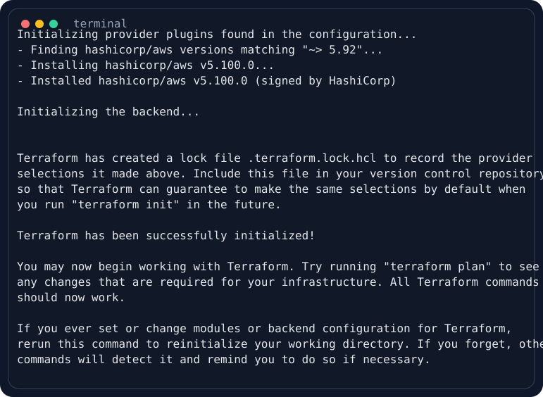
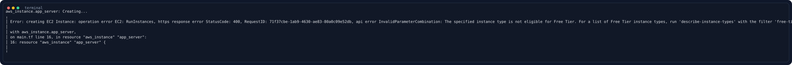
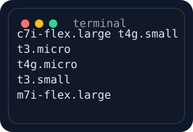
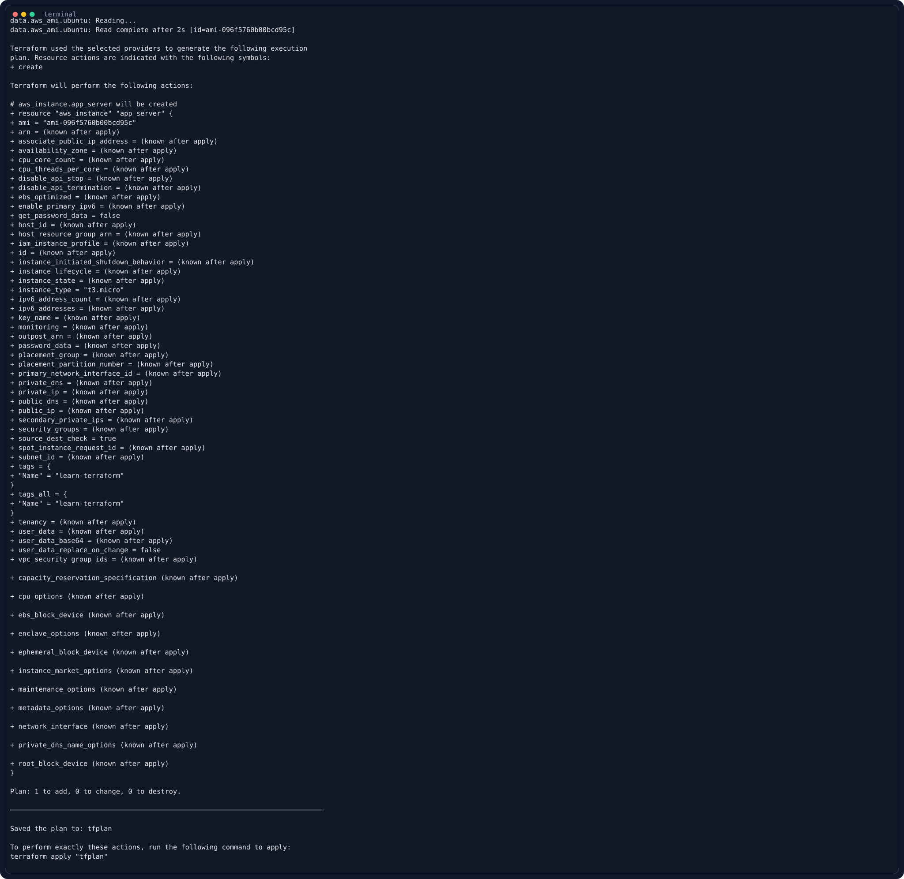
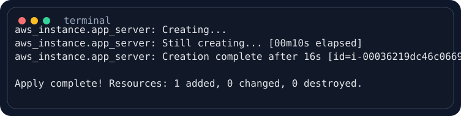
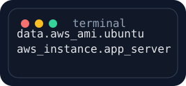
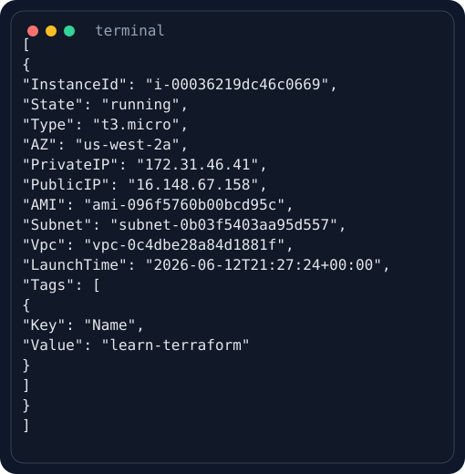
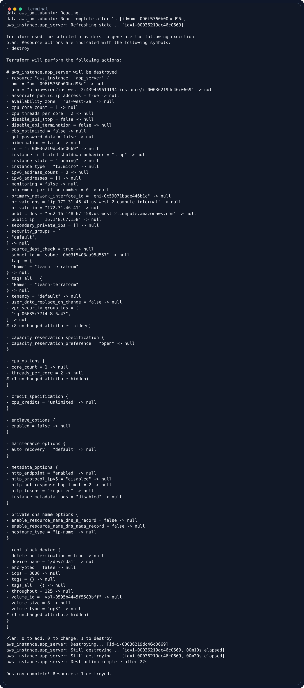
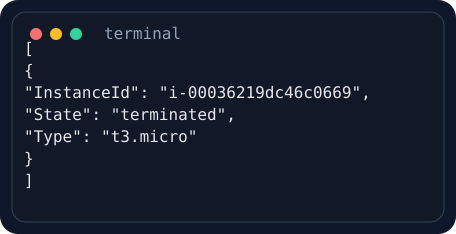

# Ponderada - Terraform AWS IaC

## Navegação
- [Objetivo](#objetivo)
- [Tutorial Base](#tutorial-base)
- [Arquitetura Provisionada](#arquitetura-provisionada)
- [Estrutura do Repositório](#estrutura-do-repositório)
- [Passo a Passo Executado](#passo-a-passo-executado)
- [Recursos Provisionados](#recursos-provisionados)
- [Evidências e Prints](#evidências-e-prints)
- [Acesso Público Observado](#acesso-público-observado)
- [Limpeza do Ambiente](#limpeza-do-ambiente)
- [Observações Finais](#observações-finais)

## Objetivo
Executar o tutorial oficial da HashiCorp para criação de infraestrutura AWS com Terraform, documentando o processo com evidências visuais, descrição objetiva do que foi feito e registro dos recursos criados.

## Tutorial Base
- Tutorial oficial: [Create infrastructure | Terraform | HashiCorp Developer](https://developer.hashicorp.com/terraform/tutorials/aws-get-started/aws-create)
- Repositório desta entrega: [tvolcati/ponderada-terraform-aws-iac-20260612](https://github.com/tvolcati/ponderada-terraform-aws-iac-20260612)

## Arquitetura Provisionada
O projeto provisiona uma instância EC2 a partir de uma AMI Ubuntu 24.04 consultada dinamicamente via `data source`.

```text
Terraform CLI
   |
   v
AWS Provider
   |
   +--> data.aws_ami.ubuntu
   |
   +--> aws_instance.app_server
```

## Estrutura do Repositório
- `terraform.tf`: versão do Terraform e versão do provider AWS.
- `main.tf`: provider, `data source` da AMI Ubuntu e instância EC2.
- `.terraform.lock.hcl`: trava a versão exata do provider instalada no `init`.
- `artifacts/images/`: evidências visuais geradas a partir das saídas reais dos comandos.
- `Captura de tela de 2025-08-19 15-42-40.png`: captura manual do console AWS com os dados da instância criada.
- `scripts/render_terminal_svg.sh`: script que transforma saídas de terminal em imagens SVG.

## Passo a Passo Executado

### 1. Preparação do ambiente
Validei Terraform, AWS CLI e credenciais antes do provisionamento.

Comando de conferência:
```bash
aws configure list
```



### 2. Escrita da configuração Terraform
Segui a estrutura recomendada pelo tutorial, separando a configuração em `terraform.tf` e `main.tf`.

`terraform.tf`
```hcl
terraform {
  required_providers {
    aws = {
      source  = "hashicorp/aws"
      version = "~> 5.92"
    }
  }

  required_version = ">= 1.2"
}
```

`main.tf`
```hcl
provider "aws" {
  region = "us-west-2"
}

data "aws_ami" "ubuntu" {
  most_recent = true

  filter {
    name   = "name"
    values = ["ubuntu/images/hvm-ssd-gp3/ubuntu-noble-24.04-amd64-server-*"]
  }

  owners = ["099720109477"] # Canonical
}

resource "aws_instance" "app_server" {
  ami           = data.aws_ami.ubuntu.id
  instance_type = "t3.micro"

  tags = {
    Name = "learn-terraform"
  }
}
```

### 3. Formatação e inicialização
Formatei os arquivos e inicializei o diretório de trabalho do Terraform.

```bash
terraform fmt
terraform init
```



### 4. Validação
Validei a consistência da configuração antes do provisionamento.

```bash
terraform validate
```

Resultado obtido: `Success! The configuration is valid.`

### 5. Primeira tentativa de apply
Ao seguir o exemplo literal do tutorial, a criação com `t2.micro` falhou nesta conta/região.

```bash
terraform apply tfplan
```



### 6. Ajuste necessário no ambiente real
Para concluir o laboratório, consultei os tipos elegíveis ao Free Tier em `us-west-2` e ajustei a instância para `t3.micro`.

```bash
aws ec2 describe-instance-types \
  --region us-west-2 \
  --filters Name=free-tier-eligible,Values=true \
  --query 'InstanceTypes[].InstanceType' \
  --output text
```



### 7. Planejamento e provisionamento com sucesso
Depois do ajuste, executei novamente o plano e a aplicação da infraestrutura.

```bash
terraform plan -out=tfplan
terraform apply tfplan
```





### 8. Inspeção do estado
Após o `apply`, consultei o estado do Terraform para confirmar o recurso acompanhado.

```bash
terraform state list
terraform state show aws_instance.app_server
```



### 9. Conferência diretamente na AWS
Também validei o recurso diretamente via AWS CLI.

```bash
aws ec2 describe-instances \
  --region us-west-2 \
  --filters Name=tag:Name,Values=learn-terraform
```



Evidência complementar obtida diretamente no console AWS.

Observação: esta captura foi feita em uma segunda provisão temporária aberta apenas para registrar o console, por isso o `Instance ID` da imagem é `i-0ec5d5b8d8ed91456`, diferente da primeira execução documentada no fluxo principal (`i-00036219dc46c0669`).


## Recursos Provisionados
Durante a primeira execução bem-sucedida do fluxo principal, o Terraform acompanhou o `data.aws_ami.ubuntu` e provisionou o recurso `aws_instance.app_server`.

| Item | Valor obtido |
| --- | --- |
| Recurso principal | `aws_instance.app_server` |
| Tipo da instância | `t3.micro` |
| AMI | `ami-096f5760b00bcd95c` |
| Instance ID | `i-00036219dc46c0669` |
| Estado validado na criação | `running` |
| Região | `us-west-2` |
| Zona de disponibilidade | `us-west-2a` |
| IP privado | `172.31.46.41` |
| IP público | `16.148.67.158` |
| VPC | `vpc-0c4dbe28a84d1881f` |
| Subnet | `subnet-0b03f5403aa95d557` |
| Security group | `default` / `sg-06685c3714c8f6a43` |
| Interface de rede | `eni-0c59071baae446b1c` |
| Volume raiz | `vol-0595b4445f5583bff` |
| Tamanho do volume | `8 GiB` |
| Tipo do volume | `gp3` |
| Tag aplicada | `Name = learn-terraform` |

## Evidências e Prints
Para evitar dúvida sobre a origem das imagens, o relatório usa dois tipos de evidência:

1. Prints automatizados gerados a partir das saídas reais dos comandos executados.
2. Captura manual do console AWS mostrando a instância criada no ambiente da nuvem.

Para evitar dúvida sobre a origem das imagens, os prints não foram feitos manualmente.

Fluxo usado:
1. Cada comando executado teve sua saída salva em arquivos `.txt`.
2. As sequências ANSI de cor do terminal foram removidas para deixar o conteúdo legível.
3. O script [render_terminal_svg.sh](/home/inteli/inteli/modulo_10/ponderada_s8/scripts/render_terminal_svg.sh) converteu esses arquivos de texto em SVG com aparência de terminal.
4. As imagens finais foram versionadas em `artifacts/images/`.

Exemplo de geração:
```bash
./scripts/render_terminal_svg.sh \
  artifacts/terminal_clean/12_terraform_apply_after_fix.txt \
  artifacts/images/06_terraform_apply_success.svg
```

Em outras palavras: as imagens SVG do relatório são renderizações visuais de saídas reais do terminal, enquanto o arquivo PNG adicionado ao repositório é uma captura manual do console AWS para comprovação visual complementar.

## Acesso Público Observado
Durante a provisão temporária feita apenas para captura do console AWS, a instância recebeu conectividade pública com os seguintes identificadores:

- `Instance ID` da captura de console: `i-0ec5d5b8d8ed91456`
- IP público observado nessa segunda provisão: `44.248.12.20`
- DNS público observado nessa segunda provisão: `ec2-44-248-12-20.us-west-2.compute.amazonaws.com`

Esses dados foram coletados imediatamente após a segunda execução de `terraform apply`, feita somente para viabilizar a captura manual do console.

Observação importante: a infraestrutura foi destruída ao final da atividade com `terraform destroy -auto-approve`. Portanto, esse IP/DNS servem como evidência histórica da execução, mas não respondem mais a ping ou acesso de rede.

Observação técnica: o tutorial base não configura aplicação web, `user_data` nem regras extras de entrada para teste externo. Então, mesmo antes do `destroy`, o objetivo era comprovar o provisionamento da EC2, não publicar um serviço HTTP para auditoria pública.

## Limpeza do Ambiente
Após coletar as evidências, destruí a infraestrutura para evitar custo residual.

```bash
terraform destroy -auto-approve
```





## Observações Finais
- A estrutura, os arquivos e o fluxo seguem o tutorial oficial da HashiCorp.
- A única adaptação necessária foi a troca de `t2.micro` para `t3.micro`, porque a AWS recusou `t2.micro` nesta execução em `us-west-2` no dia 12/06/2026.
- O ambiente foi criado, auditado, documentado e destruído ao final.
